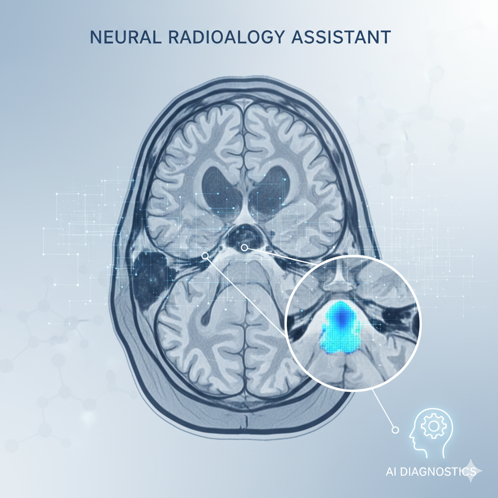
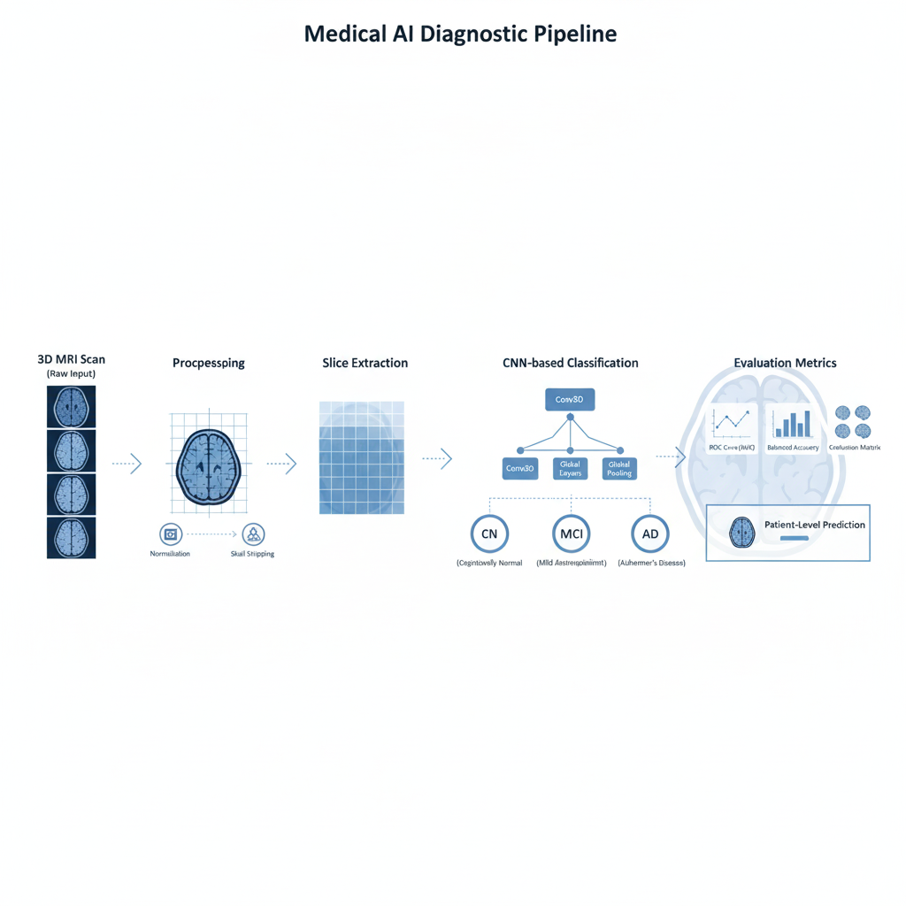
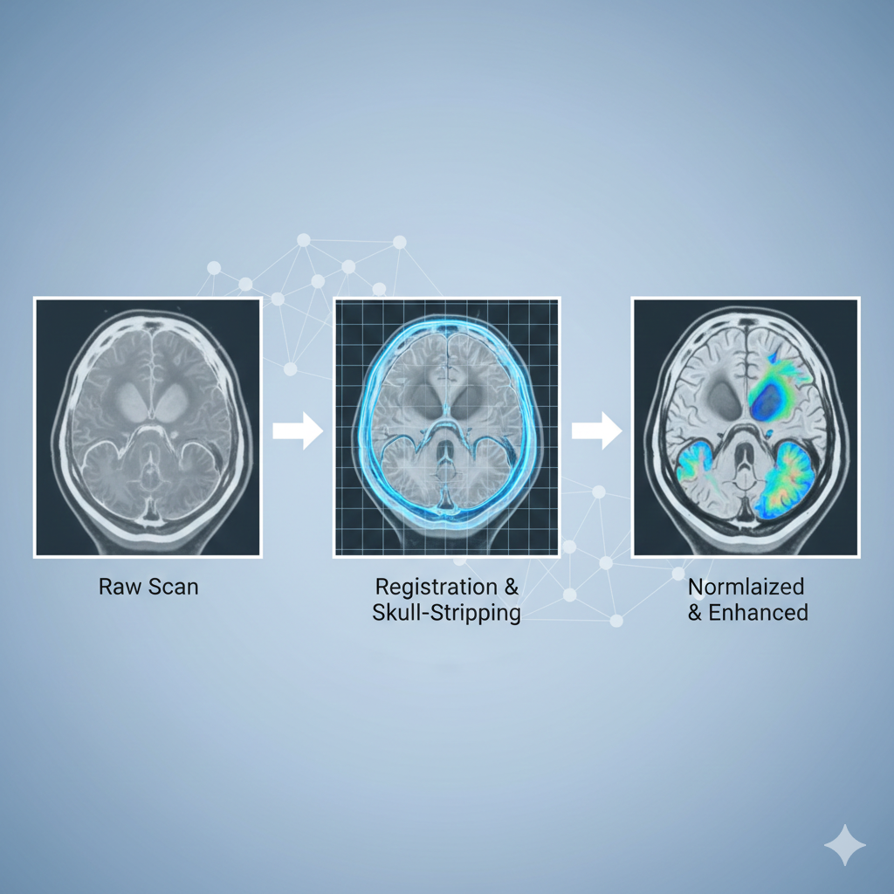

# AI-for-Healthcare_AASTRA_Parth-Khera  
## MRI-Based Neurological Disorder Detection

---

## Overview
This project implements an **end-to-end healthcare AI pipeline** for neurological disorder detection using **T1-weighted brain MRI scans**.  
It covers **dataset preprocessing**, **binary classification**, and **multi-class classification**, designed for early screening and clinical decision support.

All experiments were executed on a **Linux GPU server accessed via VPN and SSH**.

---

## Dataset
- **MRI:** Brain MRI scans in DICOM (.dcm) format  
- **Labels:** CSV file containing subject-level diagnoses:
  - **CN** – Cognitively Normal  
  - **MCI** – Mild Cognitive Impairment  
  - **AD** – Alzheimer’s Disease  

The CSV file is treated as the **single source of ground truth**.

---

## Task 1 — Dataset Preprocessing

### Objective
Ensure **data integrity, standardization, and reproducibility** prior to model training.

### Steps
- Automatic data extraction  
- Recursive DICOM loading  
- 3D MRI volume reconstruction  
- Background noise removal and global intensity normalization  
- Central slice extraction (3D → 2D)  
- Label encoding  
- Leakage-free train/test split  

### Compliance
- No data augmentation  
- No label modification  
- No sample addition or removal  
- No class rebalancing  
- No manual or disease-specific region selection  

All preprocessing steps are **uniform, deterministic, and reproducible**.

---

## Task 2 — Binary Classification (CN vs AD)

This task focuses on distinguishing **Cognitively Normal (CN)** subjects from **Alzheimer’s Disease (AD)** patients using MRI data.

**Result:**  
Achieved **>67% test accuracy**, meeting the task requirement.

---

## Task 3 — Multi-Class Classification (CN vs MCI vs AD)

This task extends the system to a **clinically realistic multi-class setting**, distinguishing:
- CN  
- MCI  
- AD  

**Result:**  
Achieved **>48% accuracy**, exceeding the required threshold.

---

## Final Summary
This project delivers a **compliant, reproducible, and clinically relevant MRI-based AI system** capable of:

- Standardized MRI preprocessing  
- Reliable binary Alzheimer’s disease detection  
- Meaningful multi-class neurological classification  

The pipeline is suitable for **real-world screening and decision-support scenarios**.
